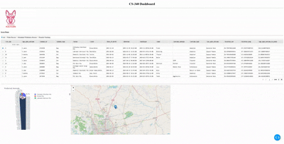
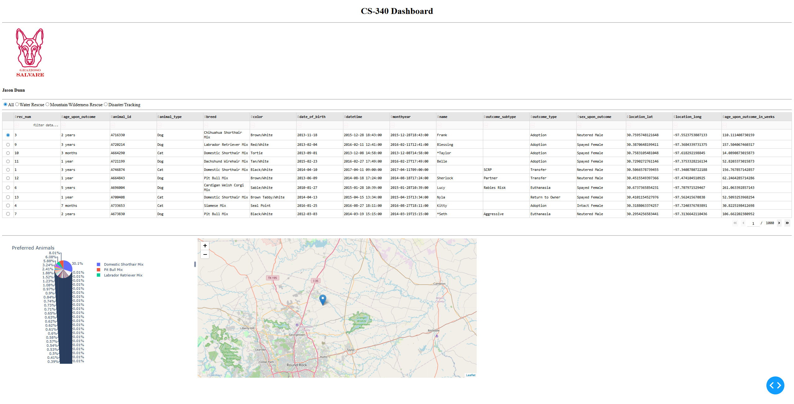
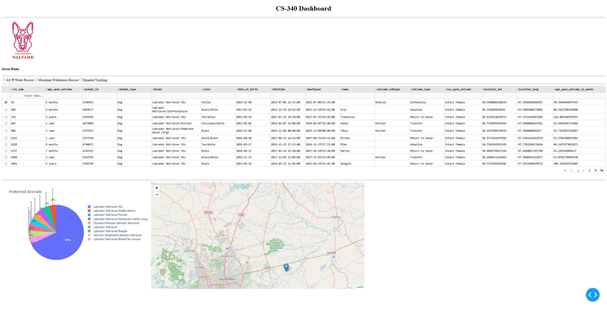

# CS 340 Project 2 README  
**Jason Dunn**

## Description
The Grazioso Salvare Dashboard is an interactive web-based dashboard built using Dash, Plotly, and MongoDB to visualize and filter animal shelter data. It allows users to explore adoptable animals and identify candidates for different rescue types.

## Screenshots






## Technologies Used

- **Python**  
  Core programming language used to build the entire application. Chosen for its extensive library support (Pandas, Plotly, NumPy) and strong integration with web frameworks such as Dash.

- **MongoDB**  
  Database used to store animal shelter data due to its ability to handle flexible, JSON-like documents.

- **PyMongo**  
  Official MongoDB driver for Python used to connect and interact with the database.

- **Dash**  
  Framework for creating interactive web dashboards without requiring JavaScript. Supports Python callbacks for dynamic UI updates.

- **Plotly**  
  Used to create interactive, web-friendly charts that integrate seamlessly with Dash.

- **Pandas**  
  Converts MongoDB query results into structured DataFrames.

- **NumPy**  
  Provides efficient array handling and performance optimizations that complement Pandas.

## Steps Taken

1. Set up the MongoDB environment by importing the dataset:
   ```bash
   mongoimport --type=csv --headerline --db aac --collection animals --drop ./aac_shelter_outcomes.csv
2. Develop and test CRUD Operations that are implemented in CRUD_Python_Module.py
3. Build Dashboard Layout.  Creating an interactive data table to show all animals in the shelter, breaking down breeds in a pie chart and a map to show the animals’ location.
4.	Created callbacks integrating the filters and updating the Pie Chart and Map information.
5.	Testing and debugging to ensure all features functioned as expected and meet the client’s expectations. 

## Challenges
I didn’t run into any challenges when completing this project. 

## Module 8 Specific Questions
- Writing programs that are maintainable, readable and adaptable starts with designing code so that each part has a clear purpose. By keeping functions focused, use meaninful variable and method names, adding comments only where they improve understanding and organize code so it can be reused in multiple places. By seperating the database operations into their own module, I created a reusable layuer between the dashboard and the database allowing the CRUD module to be used in multiple applications. 
- As a computer scientist, I approach a problem by first understanding the requirements then breaking the problem into smaller parts, designing a solution, testing it and refining it.
- On the surface level computer scientist write code, but when it comes down to it, they do a lot more than just writing code. They solve problems by designing systems that help poeple and organizations work more effectively. In this case, this project would help Grazioso Salvare work more efficient by making animal data easier to search, filter and visiualize. 

## Resources

- [MongoDB](https://www.mongodb.com/)
- [PyMongo](https://pypi.org/project/pymongo/)
- [Dash](https://dash.plotly.com/)
- [NumPy](https://numpy.org/)
- [Pandas](https://pandas.pydata.org/)
- [Plotly](https://plotly.com/)

## Author
Jason Dunn